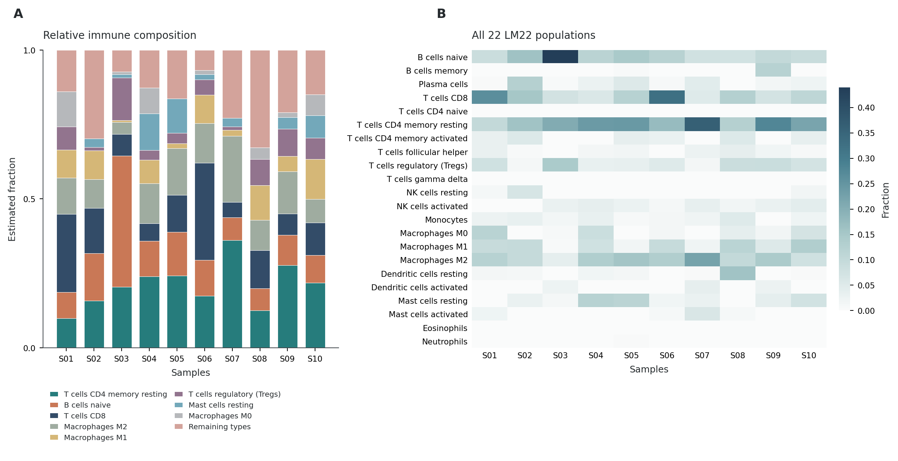

# iobrx

**Fast, faithful tumor microenvironment analysis with a pandas API.**

[](https://github.com/LCGaoZzz/iobrx/actions/workflows/ci.yml)
[](CHANGELOG.md)
[](tutorials/README.md)
[](LICENSE)

English · [中文说明](README.zh-CN.md) · [Tutorial gallery](tutorials/README.md) · [CPU compatibility](docs/PORTABILITY.md)

`iobrx` accelerates [IOBRpy](https://pypi.org/project/iobrpy/) with Rust,
parallel execution and vectorized Python. It reuses IOBRpy's references and
original workflow semantics. Inputs and outputs are ordinary DataFrames.

- **A complete analysis toolkit:** annotation, counts → TPM, four signature-scoring modes, CIBERSORT, EPIC, quanTIseq, MCP-counter and ESTIMATE.
- **Runs on ordinary CPUs:** no mandatory AVX-512; NumPy selects the sorting implementation for the current CPU. Optional native acceleration has a Python fallback.
- **Results you can inspect:** 12 executed notebooks with public data, explanatory code, result tables, and PNG/PDF/SVG figures, refined in two visual-review rounds.
- **Measured numerical fidelity:** 11 official-data parity gates pass on the validated environment. CIBERSORT weights, correlation and RMSE match exactly; stochastic P-values are handled separately.



## Install

**Validated: Python 3.11, Linux x86-64 / WSL2, including an AVX2-only desktop CPU.**
The 0.2.0 release provides a precompiled wheel. In a Python 3.11 environment:

```bash
python -m pip install --only-binary=:all: iobrx==0.2.0
python -c "import iobrx; print(iobrx.backend_info())"
```

No Rust or C++ compiler is needed. Numerical dependencies are pinned to the
validated versions so a normal install does not silently change the reference
algorithms. For the Tsinghua mirror, after it has synchronized from PyPI:

```bash
python -m pip install --only-binary=:all: -i https://pypi.tuna.tsinghua.edu.cn/simple iobrx==0.2.0
```

If a new release has not reached the mirror yet, use the first command with
`--index-url https://pypi.org/simple`. `--only-binary=:all:` makes unsupported
environments fail clearly instead of starting a source compilation.

To work through the notebooks, get the matching public data and tutorials:

```bash
git clone --branch v0.2.0 https://github.com/LCGaoZzz/iobrx.git
cd iobrx
python -m pip install --only-binary=:all: "iobrx[tutorials,test]==0.2.0"
python -m jupyterlab tutorials
```

For an existing Omicos environment, use its Python executable for the commands
above and select that same environment as the Jupyter kernel. Prefer a separate
environment if its existing numerical dependencies need different versions.
Developers can still build with `python -m pip install ".[tutorials,test]"`,
which requires Cargo and a C++17 compiler.

A versioned container supplies the analysis environment and example data:

```bash
docker run --rm ghcr.io/lcgaozzz/iobrx:0.2.0
docker run --rm -v "$PWD:/work" -w /work ghcr.io/lcgaozzz/iobrx:0.2.0 python analysis.py
```

The tutorials are in `/opt/iobrx/tutorials` inside the container. GitHub
[Release](https://github.com/LCGaoZzz/iobrx/releases/tag/v0.2.0) supplies the
wheel, source archive, checksums and immutable container digest. The container
uses locked dependencies and does not start a Jupyter server.

**CPU compatibility and operating-system packaging are separate.** Upstream
IOBRpy's binary distribution limits straightforward installation on other
Python/platform combinations. Windows users can use WSL2; macOS, ARM and
native Windows are not claimed as validated full-stack targets. See the
[compatibility notes](docs/PORTABILITY.md) for fallback behavior and limits.

## Start with a real dataset

From the repository root; the public example data is included, so this block
needs no download after installation:

```python
import numpy as np
import pandas as pd
import iobrx

iobrx.set_threads(8)
counts = pd.read_parquet("tutorials/data/eset_stad.parquet")  # genes × samples
tpm = iobrx.count2tpm(counts, check_data=True, remove_version=True)
log_expression = np.log2(tpm + 1)

# Use linear TPM for these RNA-seq deconvolution examples.
cib = iobrx.cibersort(tpm, perm=100, QN=False)
epic = iobrx.epic(tpm)["cellFractions"]
qnt = iobrx.quantiseq(tpm, tumor=True, rmgenes="default")

# Marker/enrichment scores use the illustrated log-expression input.
mcp = iobrx.mcpcounter(log_expression)
estimate = iobrx.estimate_score(log_expression, platform="rnaseq")
scores = iobrx.calculate_sig_score(
    log_expression, "signature_collection", method="integration"
)
print(cib.head())
```

Open [the complete workflow notebook](tutorials/12_complete_workflow.ipynb)
for input checks, interpretation, plots, and per-stage timers. The four
standalone signature tutorials instead use the public IMvigor210 demonstration
panel: 872 features × 348 samples.

## How long does each analysis take?

Measured on **Intel Core i9-13900KF, WSL2 Ubuntu, Python 3.11, 8 requested
threads, no AVX-512**, using the existing Omicos environment. Each row runs
in a fresh Python process: first call, followed by three repeat calls.
The main time is the **median of those three repeats**. Data loading, input
preparation and plotting are excluded; the complete workflow includes its
own normalization and analysis stages. OS file caches may already be warm.

<!-- BENCHMARK_TABLE_START -->
| Analysis / notebook | Input: features × samples | Median | First call | Parity vs IOBRpy |
| --- | --- | ---: | ---: | --- |
| [Gene annotation and duplicate resolution](tutorials/01_gene_annotation.ipynb) | 60,483 × 10 | **16.7 ms** | 36.0 ms | bit-identical |
| [Count-to-TPM normalization](tutorials/02_counts_to_tpm.ipynb) | 60,483 × 10 | **67.5 ms** | 111.6 ms | bit-identical |
| [PCA signature scoring](tutorials/03_signature_pca.ipynb) | 872 × 348 | **244.1 ms** | 600.4 ms | bit-identical |
| [Mean-based signature scoring](tutorials/04_signature_zscore.ipynb) | 872 × 348 | **78.6 ms** | 487.8 ms | bit-identical |
| [ssGSEA signature enrichment](tutorials/05_signature_ssgsea.ipynb) | 872 × 348 | **86.7 ms** | 495.9 ms | bit-identical |
| [Integrated signature scoring](tutorials/06_signature_integration.ipynb) | 872 × 348 | **336.0 ms** | 817.9 ms | bit-identical |
| [CIBERSORT immune composition](tutorials/07_cibersort.ipynb) | 48,058 × 10 | **26.37 s** | 26.99 s | bit-identical, P-value excepted |
| [EPIC cell fractions and mRNA proportions](tutorials/08_epic.ipynb) | 48,058 × 10 | **6.8 ms** | 301.9 ms | bit-identical |
| [quanTIseq immune deconvolution](tutorials/09_quantiseq.ipynb) | 48,058 × 10 | **40.9 ms** | 475.2 ms | bit-identical |
| [MCP-counter population scores](tutorials/10_mcpcounter.ipynb) | 48,058 × 10 | **1.1 ms** | 10.0 ms | bit-identical |
| [ESTIMATE stromal and immune scores](tutorials/11_estimate.ipynb) | 48,058 × 10 | **15.8 ms** | 31.0 ms | bit-identical |
| [A complete, inspectable TME workflow](tutorials/12_complete_workflow.ipynb) | 60,483 × 10 | **28.29 s** | 29.59 s | per stage, as rows above |
<!-- BENCHMARK_TABLE_END -->

These are local wall-clock measurements, not a promise for other hardware or
cohorts. CIBERSORT uses **100 permutations and `QN=False`** on the full STAD TPM
matrix. The restricted IMvigor210 signature panel is a different workload.
The complete workflow runs integration scoring on the full STAD expression
matrix, so its total is not the sum of the standalone rows.

The **Parity** column is not a timing: it states what the official gates
([`tests/test_parity_official.py`](tests/test_parity_official.py)) assert for
that analysis on the same fixtures — equal index, labels and column names, and
exact equality of every numeric cell (`max_abs_diff == 0.0`) against the
ORIGINAL `iobrpy` implementations executed in the same environment
([validation record](tutorials/results/validation.json)). The single
exception is CIBERSORT's P-value: the original seeds its permutations from OS
entropy and is not reproducible run-to-run even by itself, whereas iobrx's
P-values are seeded — stable across runs and thread counts, with the
identical formula and `1/perm` granularity. All 11 gates are re-run by CI on
every push and pull request under the
[validated constraints](tests/constraints-validated.txt), and the same
contract held on the historical 224-thread Xeon campaign
([BENCHMARKS.md](BENCHMARKS.md)). Exact parity is an observed result on those
environments, not a cross-platform floating-point guarantee
([details](docs/PORTABILITY.md)).

[Raw repeats, ranges and environment](tutorials/results/benchmark.json) ·
[Benchmark method and reproduction](tutorials/BENCHMARKS.md) ·
[Historical Xeon performance campaign](BENCHMARKS.md)

The historical 224-thread Xeon speedups are retained as a separate experiment;
they are not used to advertise desktop performance.

## Choose the right output

| Analysis | Input used in the tutorials | Output and interpretation |
| --- | --- | --- |
| `anno_eset` | Ensembl expression + annotation | Gene-symbol matrix; duplicate candidates are ranked and one row retained |
| `count2tpm` | Raw nonnegative counts | TPM matrix; filtering/deduplication can leave sums below one million |
| `calculate_sig_score` | Suitable preprocessed expression | `pca`, `zscore`, `ssgsea`, or `integration`; method-specific signature scores |
| `cibersort` | Linear TPM, `QN=False` | Relative LM22 immune fractions + fit statistics |
| `epic` | Linear TPM | Cell fractions, mRNA proportions, fit diagnostics |
| `quantiseq` | Linear TPM, tumor settings explicit | TIL10 fractions and an uncharacterized remainder |
| `mcpcounter` | `log2(TPM + 1)` | Population abundance scores, not percentages |
| `estimate_score` | `log2(TPM + 1)`, `platform="rnaseq"` | Stromal, immune and combined enrichment scores |

The upstream method named **`zscore`** averages preprocessed signature
expression; it does not guarantee standardized output. `integration`
concatenates three methods rather than averaging them. Only the exact
`platform="affymetrix"` string requests IOBRpy's calibrated ESTIMATE purity
transformation; the historical `"affy"` default does not. These RNA-seq
tutorials therefore show scores without that purity transformation.

## Compatibility and numerical fidelity

```python
iobrx.backend_info()  # native availability, sorting dispatch, bundled BLAS

# Optional: explicitly use the original IOBRpy workflow.
cib = iobrx.cibersort(tpm, perm=100, QN=False, backend="python")
# backend="rust" requires native support and reports an error if unavailable.
```

`backend="auto"` is the default. Set `IOBRX_DISABLE_RUST=1` **before importing**
to disable native acceleration process-wide. Missing native support does not
prevent using the public analysis API when IOBRpy and its dependencies are
installed. Missing compatible OpenBLAS triggers fallback for CIBERSORT/PCA.

All 11 official gates run in CI on every push and pull request under the
[validated constraints](tests/constraints-validated.txt); their assertion is
exact equality — labels and every numeric cell — against the ORIGINAL
executed on the same fixtures. Exact parity is an **observed result on
specified inputs and dependency versions**, not a cross-platform
floating-point guarantee. Native CIBERSORT uses seeded permutations; the
original Python implementation uses unseeded permutations. Its P-value column
is excluded from exact-equality assertions. See
[precision and fallback details](docs/PORTABILITY.md).

## Reproduce, test, contribute

```bash
python -m pytest -q                      # smoke + portability tests
IOBRX_TESTDATA=tutorials/data python -m pytest -q -m full
python scripts/execute_tutorials.py      # all 12, fresh kernels, embedded plots
python scripts/benchmark_tutorials.py    # first call + 3 repeats per analysis
python scripts/validate_tutorials.py     # outputs, exports and data checksums
```

Tutorials can be read directly on GitHub. To run them interactively:
`python -m jupyterlab tutorials`. Plotting helpers are in
[`tutorials/_common.py`](tutorials/_common.py); every analysis call remains
visible in its notebook. [The figure-review record](tutorials/FIGURE_REVIEW.md)
documents both refinements, with draft and final overview images.

Contributions should preserve the official parity gates and add a focused
regression test for changed numerical behavior. Files in `bench/` are frozen
historical artifacts. Report package versions, backend information, input
shape and expression scale when reporting a problem.

## Attribution and license

Cite IOBR/IOBRpy and the original methods used in your analysis. iobrx provides
acceleration and tutorials; it does not replace those methods or validate
clinical conclusions from an unlabeled example dataset.

iobrx code: [MIT](LICENSE). Vendored sources retain their
[third-party notices](rust/vendor/THIRD_PARTY_NOTICES.md). Public example data
retains its [upstream attribution and GPL-3 terms](tutorials/data/README.md).
