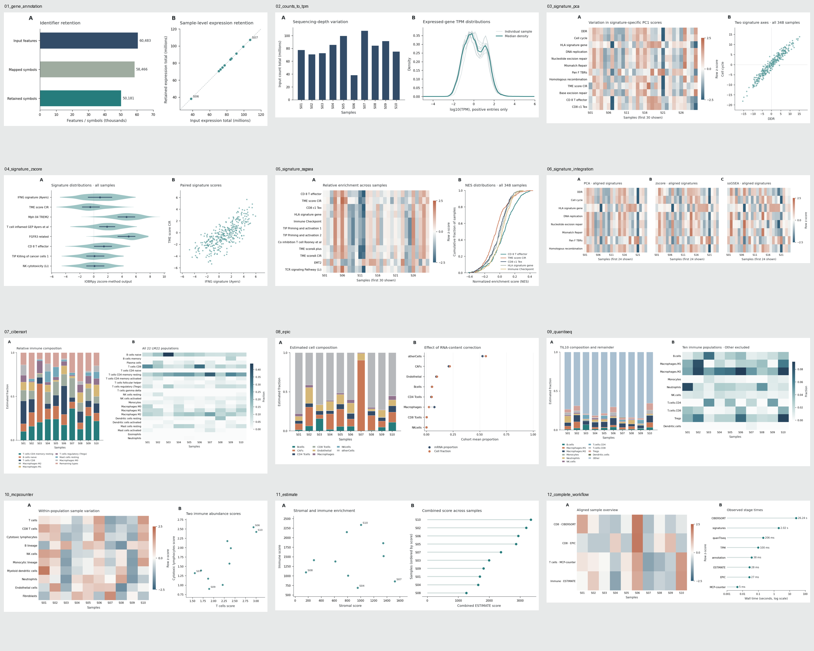

# Two-round figure review / 两轮逐图精修

All 12 notebooks were **executed three times** during the visual review:
an initial draft, a first layout revision, then a second refinement. Each pass
produced actual Matplotlib figures from the analysis output. Overview images
were inspected across the collection; dense composition plots were also
checked individually at larger size. Final notebooks contain the second-round
plots and have `metadata.iobrx.figure_revision = 2`.

[Initial draft](review/round-0.png) · [Round 1](review/round-1.png) · [Round 2](review/round-2.png)

The visual direction is restrained scientific publishing: white backgrounds,
muted teal/rust/navy, thin axes, consistent panel letters, generous spacing,
and editable vector text. This is an independent tutorial style, not a claim
of Cell editorial approval or a guarantee of journal acceptance.

| Analysis | Initial issue | Round 1: layout and readability | Round 2: refinement |
| --- | --- | --- | --- |
| Gene annotation | Crowded sample labels and heavy axes | Label extreme observations only; lighter typography and axes | Equal x/y scale and a quiet 1:1 reference line make retained totals interpretable |
| Counts → TPM | Zero spike dominated the log(TPM + 1) distribution | Explicit positive-only log10(TPM) density; input values unchanged | Individual curves become a pale context layer with a highlighted median; zero percentages are tabulated |
| PCA signatures | Saturated heatmap and large labels | Muted diverging map; shortened display labels; first-30 sample subset stated | Fixed ±2.5 row-z range, sparse colorbar ticks and faint zero reference lines |
| zscore signatures | Long labels competed with the plot | Clear label abbreviations and more restrained violin styling | Add interquartile segments and zero reference; retain median points |
| ssGSEA | External legend reduced useful panel space | Compact legend in the empty lower-right region; clarify NES and displayed subset | Empirical step curves, fixed row-z range and simplified colorbar |
| Integration | Repeated row labels and three colorbars squeezed all panels | Shared row labels and one colorbar; signatures and samples aligned | Identical ±2.5 range across all panels and more balanced overall width |
| CIBERSORT | Long legend collapsed the stacked-bar panel | Dedicated legend row restores the plot width; all 22 types remain in the heatmap | White-to-blue fraction scale, horizontal sample labels and final panel alignment |
| EPIC | Composition and scale-comparison legends competed | Dedicated legend axes; clearly separate cell fractions and mRNA proportions | Sparse quarter-scale ticks and subtle vertical guides support paired comparisons |
| quanTIseq | The large Other component obscured immune-fraction differences | Separate legend area and clean labels/axes | Full composition stays in panel A; panel B explicitly excludes Other and shows ten immune populations on a sequential scale |
| MCP-counter | Heavy heatmap styling and crowded labels | Muted colors, fewer scatter annotations, thin axes | Fixed heatmap scale and square scatter panel improve balance |
| ESTIMATE | Full frames and dense sample annotation | Selective point labels and quieter lollipop strokes | Remove the redundant vertical spine/ticks; use sparse score ticks |
| Complete workflow | Linear time axis made millisecond stages disappear | Log-time axis with readable ms/s labels and shorter titles | Plain decimal ticks, no minor-tick clutter, common heatmap scale and lighter timing axes |

## Verification

- All 12 final notebooks executed without errors and contain embedded PNGs.
- Every analysis exports a PNG, PDF and SVG. Vector files retain editable text
  (`svg.fonttype="none"`, PDF TrueType font embedding); PNGs use 220 dpi.
- Heatmap limits can saturate values outside ±2.5; row scaling and clipping
  are display choices. CSV results retain original numerical values.
- Sample abbreviations are tied to printed sample-ID mappings. No clinical
  groups, significance annotations or biological outcomes were invented.
- Plots are descriptive. A two-round visual review improves readability; it
  does not establish scientific validity beyond the stated numerical tests.

