# Executed tutorials / 已执行教程

Eleven analysis tutorials plus one complete workflow. Every notebook includes actual outputs, a figure, interpretation notes and a sample-ID mapping. 每本均已在 WSL Omicos 环境执行，并附结果和图。

Run from a clone of the repository after installing `.[tutorials]`. The data is local in `data/`; plot helpers live in `_common.py`. Open a notebook on GitHub to read it, or use `python -m jupyterlab tutorials` to run it.

[Measurement details](BENCHMARKS.md) · [Two-round figure review](FIGURE_REVIEW.md) · [Data provenance](data/README.md)

| Notebook | Question | Median analysis time | Figure exports |
| --- | --- | ---: | --- |
| [基因注释与重复条目处理](01_gene_annotation.ipynb) | Gene annotation and duplicate resolution | 16.7 ms | [PNG](figures/01_gene_annotation.png) / [PDF](figures/01_gene_annotation.pdf) / [SVG](figures/01_gene_annotation.svg) |
| [Count 转 TPM](02_counts_to_tpm.ipynb) | Count-to-TPM normalization | 67.5 ms | [PNG](figures/02_counts_to_tpm.png) / [PDF](figures/02_counts_to_tpm.pdf) / [SVG](figures/02_counts_to_tpm.svg) |
| [PCA 基因签名评分](03_signature_pca.ipynb) | PCA signature scoring | 244.1 ms | [PNG](figures/03_signature_pca.png) / [PDF](figures/03_signature_pca.pdf) / [SVG](figures/03_signature_pca.svg) |
| [zscore 方法基因签名评分](04_signature_zscore.ipynb) | Mean-based signature scoring | 78.6 ms | [PNG](figures/04_signature_zscore.png) / [PDF](figures/04_signature_zscore.pdf) / [SVG](figures/04_signature_zscore.svg) |
| [ssGSEA 基因集富集](05_signature_ssgsea.ipynb) | ssGSEA signature enrichment | 86.7 ms | [PNG](figures/05_signature_ssgsea.png) / [PDF](figures/05_signature_ssgsea.pdf) / [SVG](figures/05_signature_ssgsea.svg) |
| [PCA、zscore 与 ssGSEA 联合评分](06_signature_integration.ipynb) | Integrated signature scoring | 336.0 ms | [PNG](figures/06_signature_integration.png) / [PDF](figures/06_signature_integration.pdf) / [SVG](figures/06_signature_integration.svg) |
| [CIBERSORT 免疫细胞组成](07_cibersort.ipynb) | CIBERSORT immune composition | 26.37 s | [PNG](figures/07_cibersort.png) / [PDF](figures/07_cibersort.pdf) / [SVG](figures/07_cibersort.svg) |
| [EPIC 细胞比例与 mRNA 比例](08_epic.ipynb) | EPIC cell fractions and mRNA proportions | 6.8 ms | [PNG](figures/08_epic.png) / [PDF](figures/08_epic.pdf) / [SVG](figures/08_epic.svg) |
| [quanTIseq 免疫细胞反卷积](09_quantiseq.ipynb) | quanTIseq immune deconvolution | 40.9 ms | [PNG](figures/09_quantiseq.png) / [PDF](figures/09_quantiseq.pdf) / [SVG](figures/09_quantiseq.svg) |
| [MCP-counter 细胞群丰度评分](10_mcpcounter.ipynb) | MCP-counter population scores | 1.1 ms | [PNG](figures/10_mcpcounter.png) / [PDF](figures/10_mcpcounter.pdf) / [SVG](figures/10_mcpcounter.svg) |
| [ESTIMATE 基质与免疫评分](11_estimate.ipynb) | ESTIMATE stromal and immune scores | 15.8 ms | [PNG](figures/11_estimate.png) / [PDF](figures/11_estimate.pdf) / [SVG](figures/11_estimate.svg) |
| [完整的 TME 分析工作流](12_complete_workflow.ipynb) | A complete, inspectable TME workflow | 28.29 s | [PNG](figures/12_complete_workflow.png) / [PDF](figures/12_complete_workflow.pdf) / [SVG](figures/12_complete_workflow.svg) |

## Figure gallery

White backgrounds, muted colors, thin axes and editable vector typography. Heatmap scaling is display-only; no outcomes or sample groups are invented.

### 基因注释与重复条目处理

[Open notebook](01_gene_annotation.ipynb)

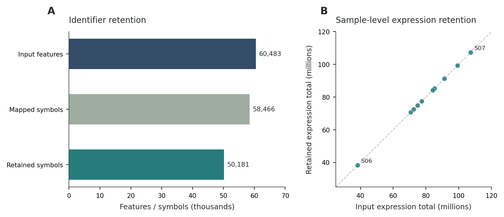

### Count 转 TPM

[Open notebook](02_counts_to_tpm.ipynb)

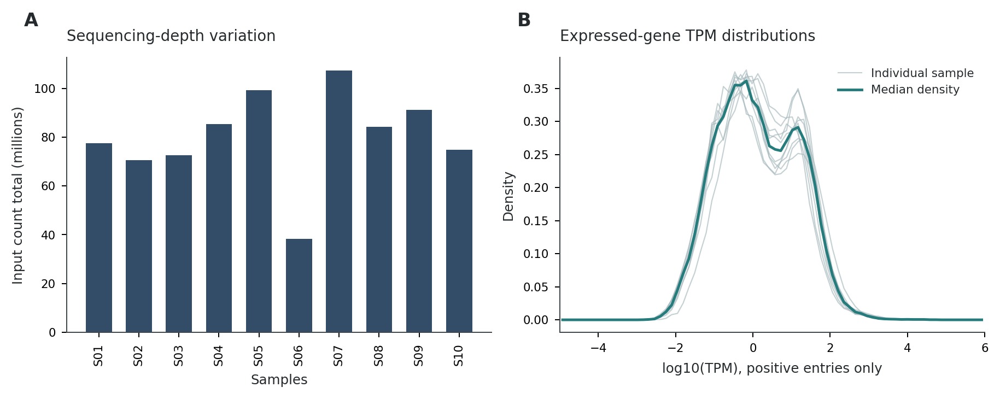

### PCA 基因签名评分

[Open notebook](03_signature_pca.ipynb)

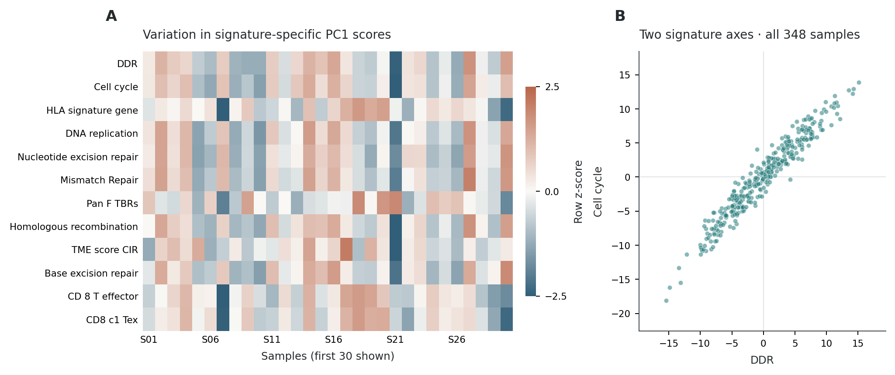

### zscore 方法基因签名评分

[Open notebook](04_signature_zscore.ipynb)

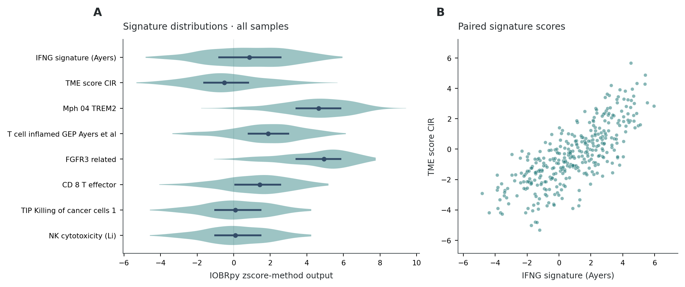

### ssGSEA 基因集富集

[Open notebook](05_signature_ssgsea.ipynb)

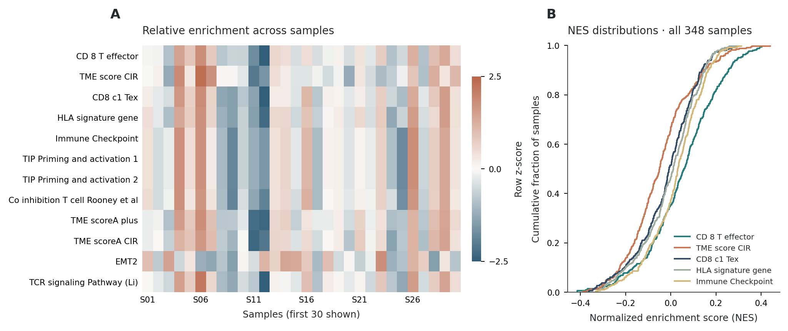

### PCA、zscore 与 ssGSEA 联合评分

[Open notebook](06_signature_integration.ipynb)

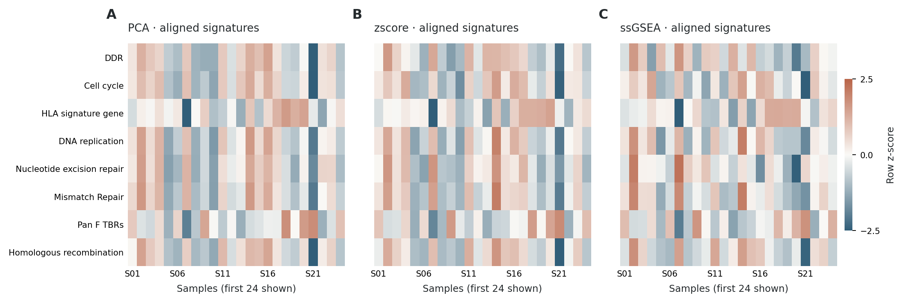

### CIBERSORT 免疫细胞组成

[Open notebook](07_cibersort.ipynb)

### EPIC 细胞比例与 mRNA 比例

[Open notebook](08_epic.ipynb)

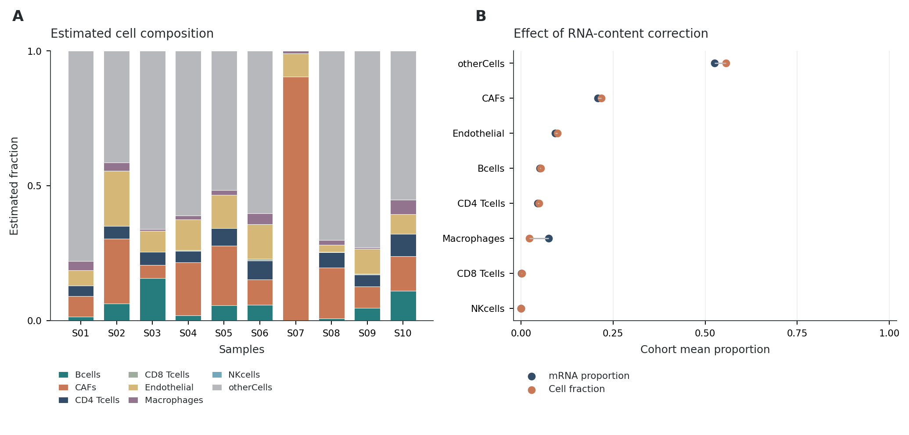

### quanTIseq 免疫细胞反卷积

[Open notebook](09_quantiseq.ipynb)

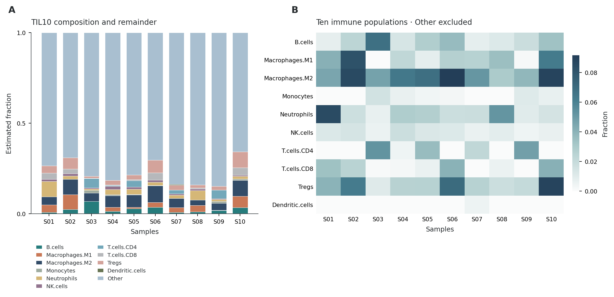

### MCP-counter 细胞群丰度评分

[Open notebook](10_mcpcounter.ipynb)

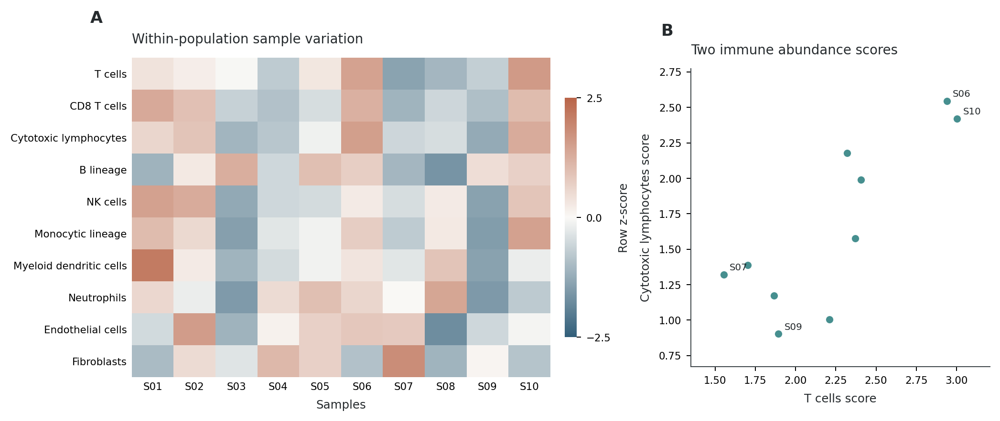

### ESTIMATE 基质与免疫评分

[Open notebook](11_estimate.ipynb)

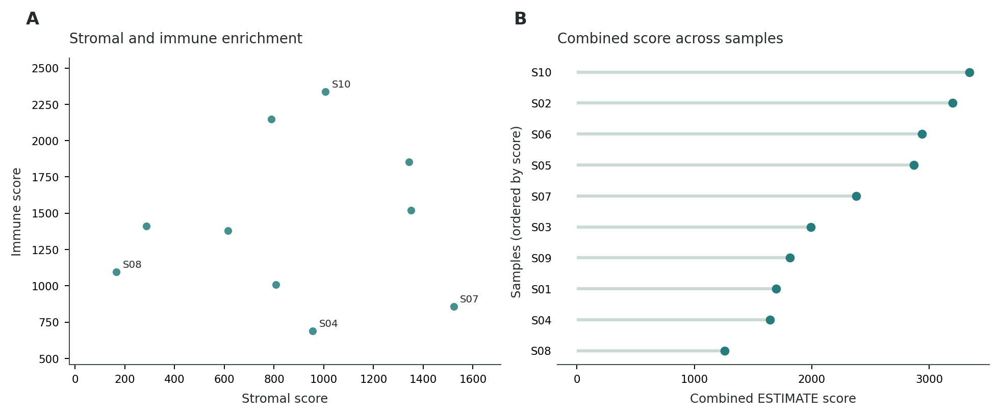

### 完整的 TME 分析工作流

[Open notebook](12_complete_workflow.ipynb)

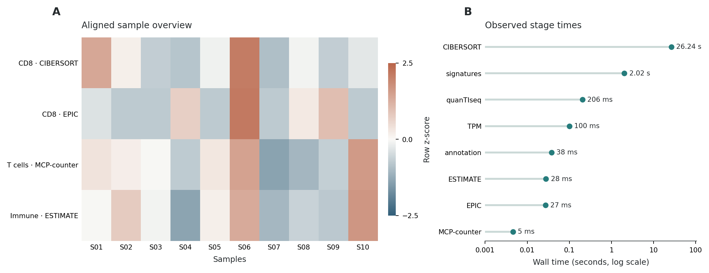
